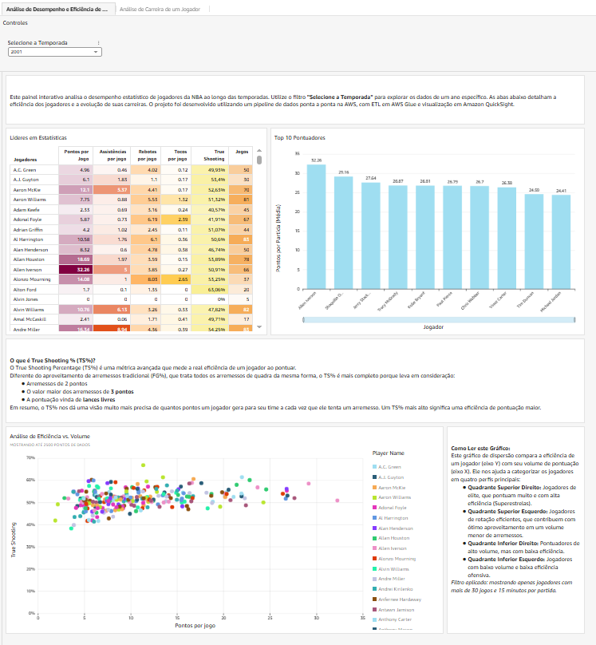
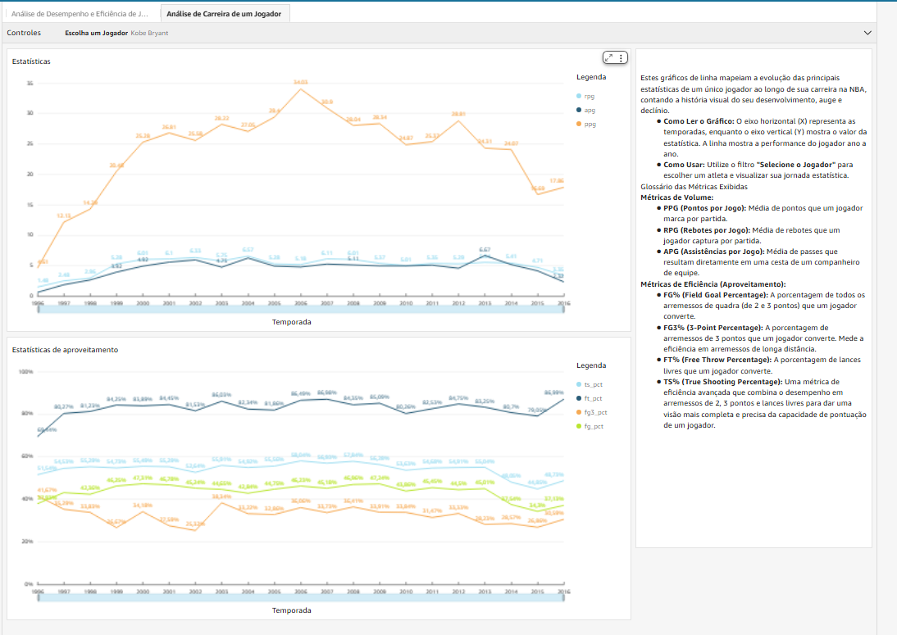

# Projeto: Pipeline de Dados e Análise de Desempenho da NBA na AWS

Este projeto de portfólio demonstra a construção de um pipeline de dados de ponta a ponta na nuvem AWS para ingerir, processar, analisar e visualizar estatísticas de desempenho de jogadores da NBA.

## 📊 Dashboard Interativo no QuickSight

O produto final é um dashboard interativo no Amazon QuickSight que permite a análise de desempenho e eficiência de jogadores por temporada. O painel inclui análises de líderes de estatísticas, um estudo sobre eficiência de arremessos (Volume vs. Eficiência com TS%) e uma visão da evolução da carreira de jogadores individuais.

_Dashboard Principal_

_Análise de Eficiência (PPG vs. TS%)_

_Análise de Carreira_

## ⚙️ Arquitetura da Solução

O pipeline foi construído utilizando uma arquitetura serverless e escalável na AWS:

**S3 (Data Lake) → AWS Glue (ETL com PySpark) → S3 (Dados Processados em Parquet) → AWS Glue Crawler → Amazon Athena → Amazon QuickSight (SPICE)**

## 🛠️ Tecnologias Utilizadas

* **Cloud:** AWS (S3, Glue, Athena, QuickSight, IAM)
* **Linguagem & Biblioteca:** Python, PySpark
* **Consulta de Dados:** SQL (via Amazon Athena)
* **Formatos de Dados:** CSV (bruto), Parquet (processado)

## 🚀 Processo do Projeto

1.  **Engenharia de Dados (ETL):** Um job no AWS Glue, escrito em PySpark, é responsável por:
    * Ler os dados brutos (CSV) de um Data Lake no S3.
    * Realizar a limpeza e o tratamento de dados, incluindo a correção de um cabeçalho malformado.
    * Agregar estatísticas por jogador e por temporada.
    * Calcular métricas de desempenho (PPG, RPG, APG) e de eficiência (FG%, FG3%, FT%, TS%).
    * Salvar o dataset enriquecido e limpo de volta no S3 em formato Parquet, otimizado para análises.

2.  **Disponibilização para Análise:**
    * Um Crawler do AWS Glue cataloga os dados processados, criando uma tabela no AWS Data Catalog.
    * O Amazon Athena utiliza essa tabela para permitir consultas SQL diretamente nos arquivos Parquet.

3.  **Visualização de Dados:**
    * O Amazon QuickSight se conecta ao Athena e importa os dados para o seu motor em memória (SPICE) para garantir alta performance.
    * O dashboard interativo foi construído com filtros, tabelas e gráficos detalhados para permitir uma exploração aprofundada dos dados.

## 💡 Desafios Técnicos e Soluções

* **Parsing de CSV Malformado:** O principal arquivo de dados possuía um cabeçalho com uma vírgula inicial, o que impedia a inferência de esquema do Spark. A solução foi ler o arquivo sem cabeçalho, remover a primeira linha programaticamente via RDD e nomear as colunas manualmente no script, tornando o carregamento robusto.
* **Depuração de Permissões IAM no S3:** Durante o desenvolvimento, o job falhava na segunda execução ao tentar sobrescrever (`overwrite`) os dados. A investigação revelou que a operação de `overwrite` do Spark requer não apenas `s3:PutObject` e `s3:DeleteObject`, mas também a permissão `s3:ListBucket` no prefixo de destino. A política IAM foi ajustada para refletir isso. Para fins de aprendizado, a política `AmazonS3FullAccess` foi utilizada para focar na engenharia de dados, com a ciência de que uma política restritiva é a melhor prática em produção.

---
